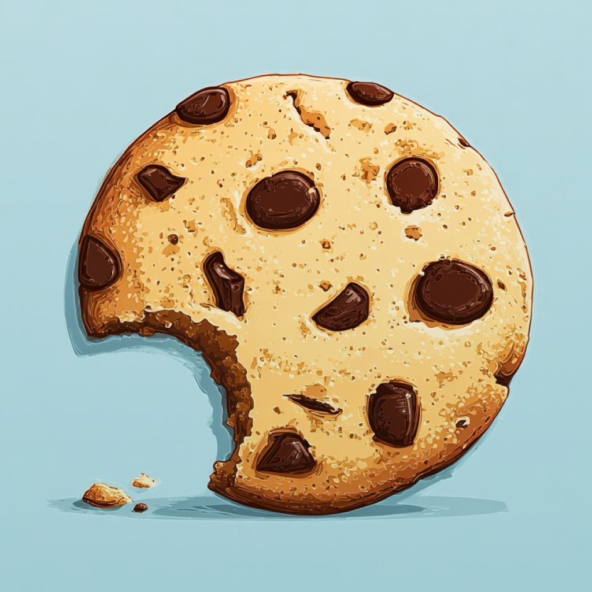

<p align="center">
  <h1 align="center">🍪 Crunch</h1>
  <p align="center">
    
  </p>
  <p align="center">
    <strong>Blazing-fast, 100% local image optimizer built for macOS.</strong>
  </p>
  <p align="center">
    Compress JPEG · Crush PNG · Convert to WebP · Strip Metadata — all without leaving your Mac.
  </p>
</p>

---

## ✨ Features

| Feature | Details |
|---|---|
| **Smart Compression** | MozJPEG, pngquant, oxipng & cwebp — the best open-source tools in one pipeline. Uses SSIM.js to achieve visually lossless compression dynamically. |
| **Responsive Image Generator** | Generate perfectly sized derivatives with WebP fallbacks. Automagically creates copy-pastable `<picture>`/`` HTML snippets and JSON manifests. |
| **Metadata & Privacy Cleanup** | Safely scrub invisible junk (EXIF, XMP, IPTC, GPS) from your files. Configurable presets for web-safe delivery or keeping copyright info, with explicit ICC profile control. |
| **WebP Conversion** | Batch-convert any image to WebP with configurable quality presets or aggressive replace modes. |
| **SSIM Quality Guard** | Automatic visual-fidelity check (default ≥ 0.99) prevents over-compression. |
| **Watch Folders** | Pick any directory and Crunch optimizes new files the moment they appear. |
| **Clipboard Support** | Copy a screenshot → Crunch grabs and optimizes it instantly. |
| **macOS-Native UI** | Dark mode, system-style toggles, sliders, tabs — feels right at home. |
| **Non-Destructive** | Originals stay untouched; optimized copies land in an `Optimized/` subfolder (unless configured otherwise). |
| **Apple Silicon Ready** | Multi-threaded worker pool that scales with your CPU cores. |

## 🖥 Screenshots

> _Coming soon_

## 🆕 Recent UI Updates

- Motion-powered animated tab pill transitions in Settings
- Motion-animated switches and shimmering empty-state text cues
- Unified button system across views (single primary button style)
- Refined sticky headers and modal layering/backdrop behavior
- Compact macOS-like select controls with hover/pressed states

## 🛠 Tech Stack

| Layer | Technology |
|---|---|
| Runtime | Electron 40 |
| UI | React 19 · TypeScript 5.9 · Tailwind CSS 4.2 |
| Bundler | Vite 7 |
| Image Processing | sharp · MozJPEG · pngquant · oxipng · cwebp |
| Quality Metrics | SSIM.js |

## 📁 Project Structure

```
crunch/
├── apps/desktop/
│   ├── src/
│   │   ├── main/               # Electron main process
│   │   │   ├── optimizer/      # Compression pipeline, tools & metadata
│   │   │   ├── watch/          # Folder-watch service
│   │   │   └── clipboardWatcher.ts
│   │   ├── renderer/           # React front-end (Zustand + React 19)
│   │   │   ├── components/     # UI components (Settings, FileTable, ResponsiveMode)
│   │   │   └── hooks/          # Custom React hooks
│   │   └── shared/             # Shared IPC types
│   └── resources/
│       ├── bin/                # Bundled native binaries
│       └── lib/                # Shared dynamic libraries
├── docs/
├── scripts/
└── package.json                # Workspace root
```

## 🚀 Getting Started

### Prerequisites

- **macOS** 13+ (Ventura or later)
- **Node.js** ≥ 22
- **npm** ≥ 10

### Install & Run

```bash
# Clone the repo
git clone https://github.com/huseyinemanet/crunch.git
cd crunch

# Install dependencies
npm install

# Start in development mode
cd apps/desktop
npm run dev
```

### Build & Package

```bash
# Build production assets + create DMG installer
npm run dist
```

The `.dmg` file will be in `apps/desktop/release/`.

## 🔒 Safety & Privacy

- **Metadata Cleanup** — Strip unnecessary bytes and identifiable GPS locations from your images securely.
- **Non-Destructive** — Originals are never modified; results go to an `Optimized/` subfolder.
- **Atomic Writes** — Temp files + atomic rename prevent corruption.
- **100% Offline** — Zero cloud calls. Your images never leave your Mac.

## 📄 License

MIT © 2026
